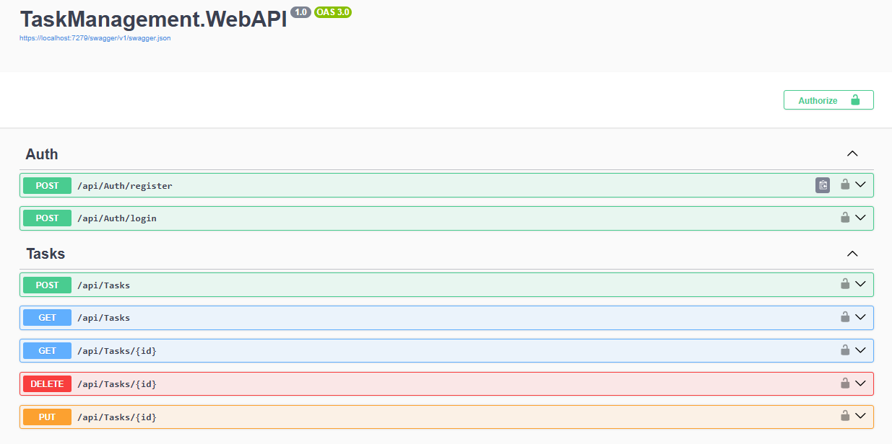

# Task Management API

REST API for task management built with ASP.NET Core Web API using Clean Architecture principles.

## Features

* JWT Authentication
* ASP.NET Identity
* Role-based Authorization (Admin/User)
* CRUD operations for tasks
* User-specific task access
* CQRS pattern with MediatR
* FluentValidation
* Global Exception Handling Middleware
* Entity Framework Core + PostgreSQL
* Swagger/OpenAPI documentation

## Technologies

* ASP.NET Core Web API
* Entity Framework Core
* PostgreSQL
* ASP.NET Identity
* JWT Authentication
* MediatR
* AutoMapper
* FluentValidation
* Swagger

## Architecture

The project follows Clean Architecture principles and is separated into:

* Domain
* Application
* Infrastructure
* WebAPI

CQRS pattern is implemented using MediatR.

## Authentication & Authorization

* JWT-based authentication
* ASP.NET Identity for user management
* Role-based authorization
* Admin/User roles support

## Getting Started

### 1. Clone repository

```bash
git clone https://github.com/AndreyDot/TaskManagement.git
```

### 2. Configure appsettings.json

Fill in your PostgreSQL connection string and JWT settings.

### 3. Apply migrations

```bash
dotnet ef database update --startup-project TaskManagement.WebAPI
```

### 4. Run project

```bash
dotnet run --project TaskManagement.WebAPI
```

## Swagger

Swagger UI available at:

```text
https://localhost:7279/swagger
```

## Project Structure

```text
TaskManagement.Domain
TaskManagement.Application
TaskManagement.Infrastructure
TaskManagement.WebAPI
```
## Swagger Preview

